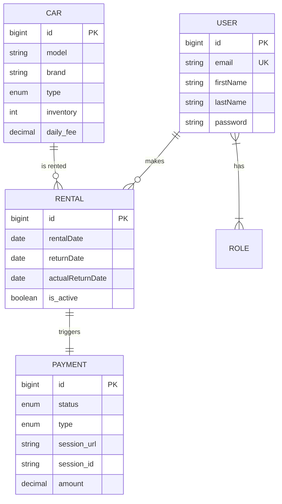
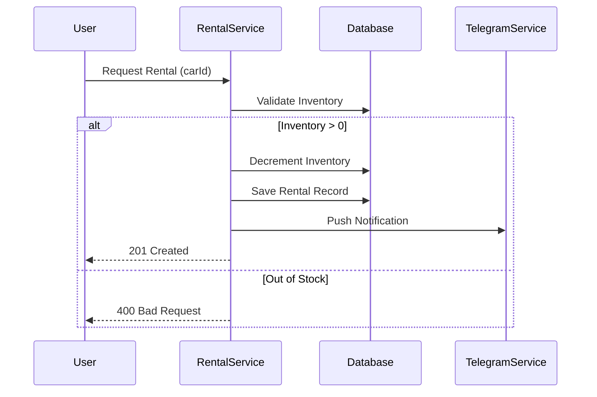

# 🚗 Car Sharing Service API

## 📌 Table of Contents

* [🌟 Overview](https://www.google.com/search?q=%23-overview)
* [🏗️ System Architecture](https://www.google.com/search?q=%23%25EF%25B8%258F-system-architecture)
* [🔐 Authentication](https://www.google.com/search?q=%23-authentication)
* [🔄 Rental Process](https://www.google.com/search?q=%23-rental-process)
* [🛡️ Access Control](https://www.google.com/search?q=%23%25EF%25B8%258F-access-control)
* [🤖 Notifications](https://www.google.com/search?q=%23-notifications)
* [💳 Payments](https://www.google.com/search?q=%23-payments)
* [🛠 Tech Stack](https://www.google.com/search?q=%23-technology-stack)
* [⚙️ Setup](https://www.google.com/search?q=%23%25EF%25B8%258F-installation--setup)
* [📖 Documentation](https://www.google.com/search?q=%23-api-documentation)

---

## 🌟 Overview

**Car Sharing Service** is a comprehensive RESTful API designed to automate vehicle rentals. It provides a digital infrastructure for managing car fleets, tracking active rentals, processing secure payments via Stripe, and keeping administrators informed through automated Telegram notifications.

---

## 🏗️ System Architecture

The core data model follows a relational structure optimized for consistency and performance:



---

## 🔐 Authentication

The API implements **JWT (JSON Web Token)** for stateless and secure authorization:

1. **Identity**: Password hashing via **BCrypt**.
2. **Access**: Bearer tokens must be included in the `Authorization` header for all protected endpoints.
3. **Security**: Token validation is performed by a dedicated filter in the Spring Security chain.

---

## 🔄 Rental Process

The system ensures data integrity during the booking process:



---

## 🛡️ Role-Based Access Control (RBAC)

The service enforces strict permission sets:

* **Manager**: Full control over car inventory, user roles, and monitoring of all rentals.
* **Customer**: Limited to managing their own profile, viewing cars, and processing their payments.

---

## 🤖 Telegram Notifications

Integrated with the **Telegram Bot API** for real-time monitoring:

* **Real-time Alerts**: New rentals and successful payments.
* **Scheduled Tasks**: Automatic daily checks for overdue rentals via Spring's `@Scheduled` tasks, notifying managers about unreturned vehicles.

---

## 💳 Payment Integration

Secure transactions are handled via **Stripe API**:

* **Dynamic Sessions**: Total price calculation based on rental duration.
* **Fine System**: Automated multiplier for overdue returns.
* **Callbacks**: Webhook-ready logic for handling successful and cancelled sessions.

---

## 🛠 Technology Stack

* **Backend**: Java 17, Spring Boot 3
* **Security**: Spring Security, JWT, BCrypt
* **Data**: Hibernate, Spring Data JPA, MySQL
* **Migrations**: Liquibase
* **Integrations**: Stripe API, Telegram Bot API
* **DevOps**: Docker, Docker Compose
* **Mapping**: MapStruct, Lombok

---

## ⚙️ Installation & Setup

### 1. Environment Configuration

Create a `.env` file in the root directory:

```bash
MYSQL_ROOT_PASSWORD=your_mysql_password
MYSQL_DATABASE=car_sharing_db
STRIPE_SECRET_KEY=your_stripe_secret
TELEGRAM_BOT_TOKEN=your_bot_token
TELEGRAM_CHAT_ID=your_chat_id

```

### 2. Deployment

Launch the entire infrastructure using Docker:

```bash
mvn clean package -DskipTests
docker-compose up --build

```

---

## 📖 API Documentation

Once the service is running, explore the interactive Swagger UI:
🔗 **http://localhost:8080/api/swagger-ui.html**

---

## 🧪 Testing

The project is backed by a robust test suite focusing on business-critical logic:

```bash
mvn test

```

*Includes Integration Tests and Unit Tests for Services and Controllers.*

---

**Maintainer:** – leadervlod@gmail.com