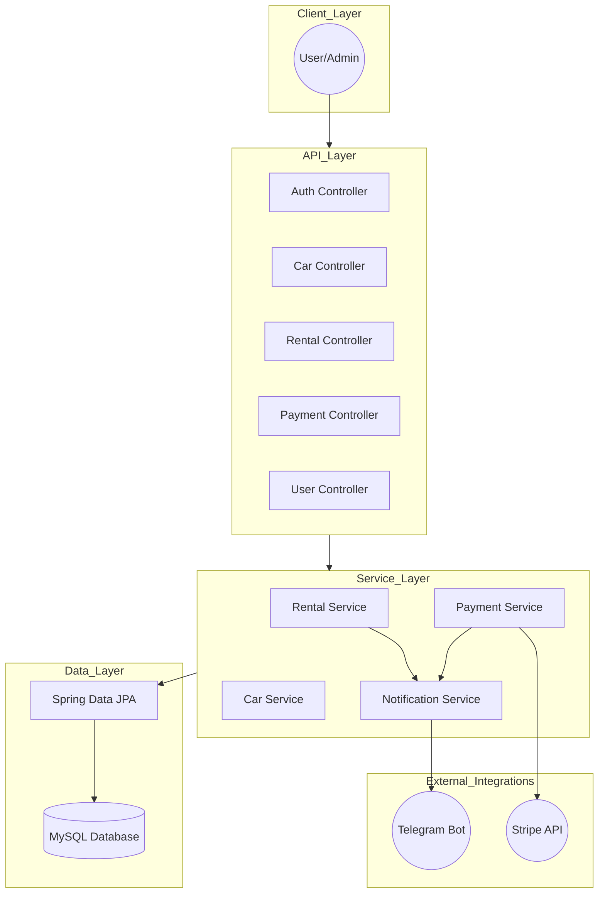
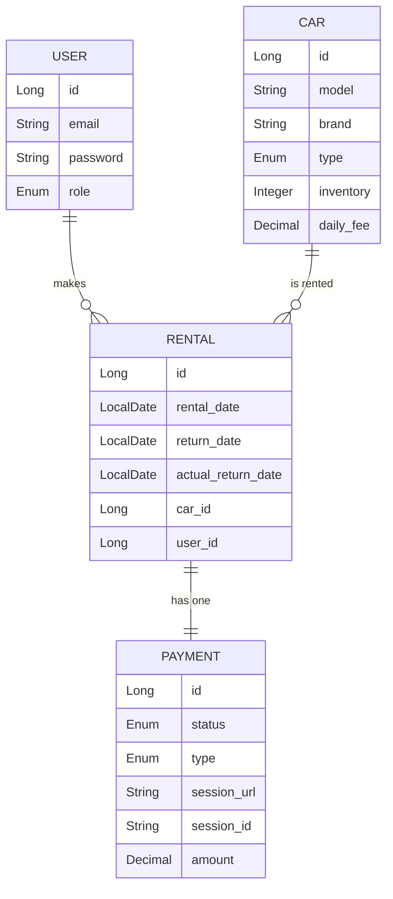

# 🚗 Car Sharing Service API

An automated management system for a modern car sharing service. This project transforms an outdated paper-based system into a high-performance RESTful API, streamlining car inventory, user rentals, and automated payments.

## 🌟 Key Features

* **🛡️ Secure Authentication**: JWT-based login and registration with role-based access control (Manager vs. Customer).
* **🏎️ Inventory Management**: Real-time tracking of car availability and detailed specifications.
* **📅 Rental Lifecycle**: Automated rental tracking, including overdue monitoring and instant inventory updates.
* **💳 Stripe Integration**: Seamless credit card payments and fine calculation for overdue rentals.
* **🤖 Telegram Notifications**: Instant alerts for new rentals, successful payments, and daily overdue reports.
* **🐳 Dockerized**: Fully containerized environment for easy deployment.

---

## 🏗️ System Architecture

The system follows a layered architecture, ensuring separation of concerns between the API layer, business logic, and external integrations.



---

## 📊 Database Schema

The following diagram illustrates the relationships between users, cars, rentals, and payments.



---

## 🚀 Getting Started

### Prerequisites

* **Java 17**
* **Docker & Docker Compose**
* **Stripe Account** (for API keys)
* **Telegram Bot** (via BotFather)

### Installation

1. **Clone the repository:**
```bash
git clone https://github.com/your-org/car-sharing-app.git
cd car-sharing-app

```


2. **Configure Environment Variables:**
   Create a `.env` file in the root directory based on `.env.sample`:
```env
MYSQL_ROOT_PASSWORD=your_pass
STRIPE_SECRET_KEY=your_stripe_key
TELEGRAM_BOT_TOKEN=your_bot_token
TELEGRAM_CHAT_ID=your_chat_id

```


3. **Run with Docker:**
```bash
docker-compose up --build

```


---

## 🛠️ API Endpoints

| Category | Method | Endpoint | Description |
| --- | --- | --- | --- |
| **Auth** | `POST` | `/register` | Register a new user |
| **Cars** | `GET` | `/cars` | List all available cars |
| **Rentals** | `POST` | `/rentals` | Create a new rental |
| **Rentals** | `POST` | `/rentals/{id}/return` | Return a car |
| **Payments** | `POST` | `/payments` | Create Stripe session |
| **Users** | `GET` | `/users/me` | Get profile information |
