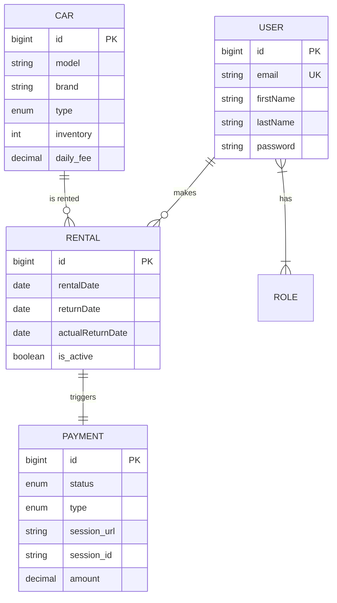
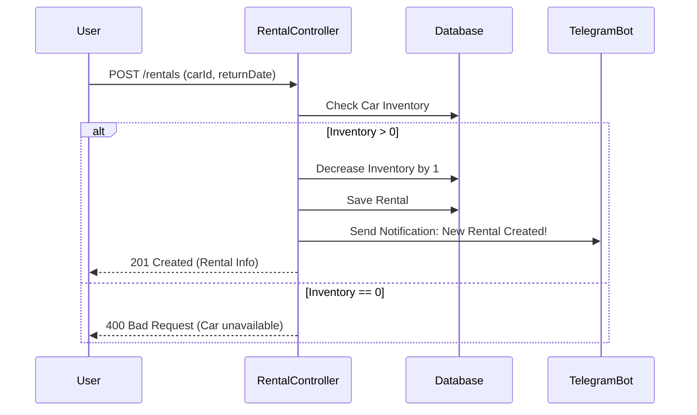

Here is the clean, professional `README.md` for your **Car Sharing Service** project in English.

---

# 🚗 Car Sharing Service API

## 📌 Table of Contents

* [🌟 Overview](https://www.google.com/search?q=%23-overview)
* [🏗️ System Architecture](https://www.google.com/search?q=%23%EF%B8%8F-system-architecture)
* [🔐 Authentication Flow](https://www.google.com/search?q=%23-authentication-flow)
* [🔄 Rental Process Flow](https://www.google.com/search?q=%23-rental-process-flow)
* [🛡️ Role-Based Access Control](https://www.google.com/search?q=%23%EF%B8%8F-role-based-access-control)
* [🤖 Telegram Notifications](https://www.google.com/search?q=%23-telegram-notifications)
* [💳 Payment Integration](https://www.google.com/search?q=%23-payment-integration)
* [🛠 Technology Stack](https://www.google.com/search?q=%23-technology-stack)
* [🚀 Key Features](https://www.google.com/search?q=%23-key-features)
* [⚙️ Installation & Setup](https://www.google.com/search?q=%23%EF%B8%8F-installation--setup)
* [📖 API Documentation](https://www.google.com/search?q=%23-api-documentation)
* [🧪 Testing](https://www.google.com/search?q=%23-testing)

---

## 🌟 Overview

**Car Sharing Service** is a modern RESTful API platform designed to automate car rentals. The project eliminates manual
paperwork by providing digital tools to manage car fleets, rentals, users, and automated payments via Stripe.

---

## 🏗️ System Architecture

The following Entity-Relationship Diagram represents the core data model:



---

## 🔐 Authentication Flow

The system uses **JWT (JSON Web Token)** for secure communication:

1. **Registration**: New users create an account via `POST /auth/register`.
2. **Login**: Users authenticate via `POST /auth/login`.
3. **Verification**: The server validates credentials (BCrypt) and issues a JWT.
4. **Access**: Users include the token in the `Authorization: Bearer <token>` header for protected requests.

---

## 🔄 Rental Process Flow

The rental logic includes inventory validation and admin notifications:



---

## 🛡️ Role-Based Access Control (RBAC)

| Endpoint                      | MANAGER | CUSTOMER |
|-------------------------------|---------|----------|
| **GET /cars**                 | ✅       | ✅        |
| **POST /cars**                | ✅       | ❌        |
| **GET /users/me**             | ✅       | ✅        |
| **PUT /users/{id}/role**      | ✅       | ❌        |
| **POST /payments**            | ✅       | ✅        |
| **POST /rentals/{id}/return** | ✅       | ✅        |

---

## 🤖 Telegram Notifications

Integrated with the **Telegram Bot API** to keep managers informed:

* **New Rental**: Instant notification when a car is booked.
* **Overdue Task**: Daily scheduled check (using `@Scheduled`) for overdue rentals.
* **Payment Alerts**: Notifications for successful Stripe transactions.

---

## 💳 Payment Integration

Payments are handled via **Stripe API**:

* Automatic session creation with rental total calculation.
* Support for **Fines** (overdue returns) with a preconfigured multiplier.
* Success and Cancel callback endpoints.

---

## 🛠 Technology Stack

* **Java 17 / Spring Boot 3**
* **Spring Security & JWT** — Authentication & Authorization.
* **Hibernate / Spring Data JPA** — ORM & Data Persistence.
* **MySQL** — Primary Database.
* **Liquibase** — Database Schema Version Control.
* **Stripe API** — Payment Processing.
* **Telegram Bot API** — Notification Service.
* **Docker & Docker Compose** — Containerization.
* **MapStruct & Lombok** — Boilerplate reduction.

---

## 🚀 Key Features

* **Soft Delete**: Uses Hibernate `@SQLDelete` to keep records in the DB while marking them deleted.
* **Inventory Management**: Real-time tracking of car availability.
* **Automatic Fines**: Calculates overdue charges based on return dates.
* **Scalable Architecture**: Docker-ready for easy deployment.

---

## ⚙️ Installation & Setup

### 1. Clone the repository

```bash
git clone https://github.com/your-org/car-sharing-app.git
cd car-sharing-app

```

### 2. Environment Configuration

Create a `.env` file in the root directory:

```bash
MYSQL_ROOT_PASSWORD=your_password
STRIPE_SECRET_KEY=your_stripe_key
TELEGRAM_BOT_TOKEN=your_token
TELEGRAM_CHAT_ID=your_chat_id

```

### 3. Run with Docker

```bash
mvn clean package -DskipTests
docker-compose up --build

```

---

## 📖 API Documentation

The Swagger UI interactive documentation is available after launch:
🔗 **http://localhost:8080/api/swagger-ui.html**

### Default Admin Credentials:

* **Email:** `admin@example.com`
* **Password:** `admin12345`

---

## 🧪 Testing

Run the test suite (JUnit 5, Mockito, Testcontainers):

```bash
mvn test

```

*The project maintains > 60% code coverage for core business logic.*

---

**Developed for Mate Academy** 📧 Contact: leadervlod@gmail.com
